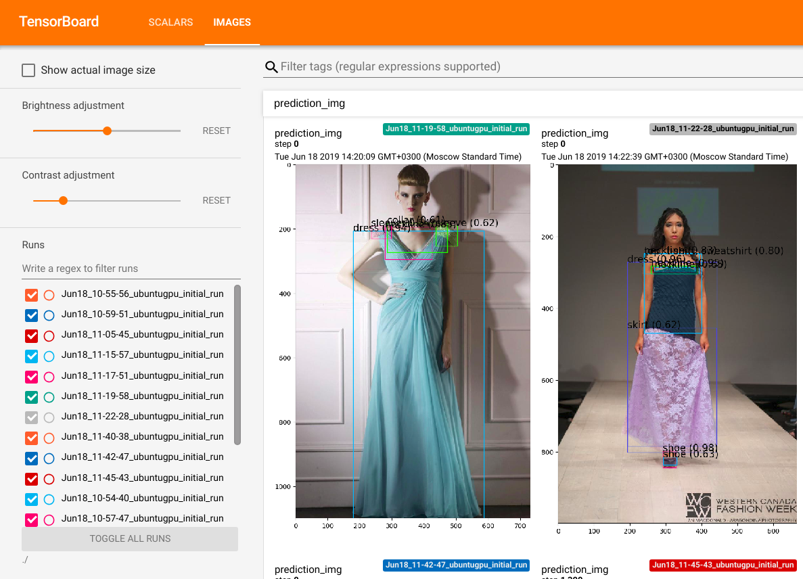
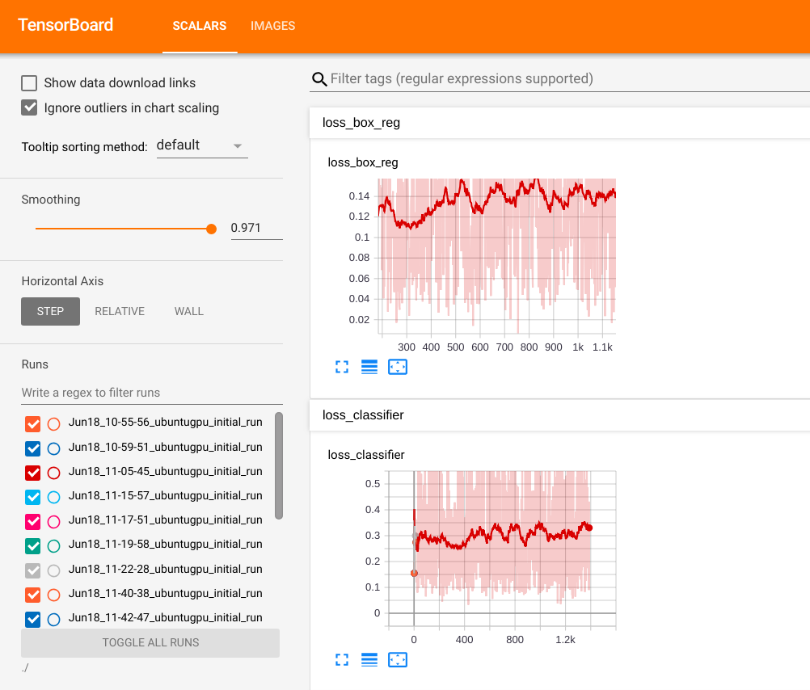
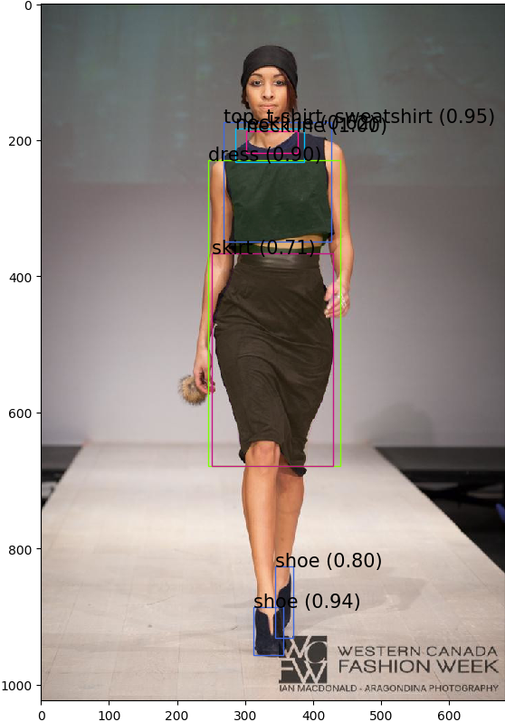

# IMaterialist MRCNN

* dataset.py - описан класс IMaterialistDataset(Dataset)
* model.py - загрузка предобученной модели
* transforms.py и utils.py - файлики со всякими функциями
* rcnn_train.py - запуск тренировки сети

### Процесс обучения можно отслеживать в tb

### Пример работы сети

